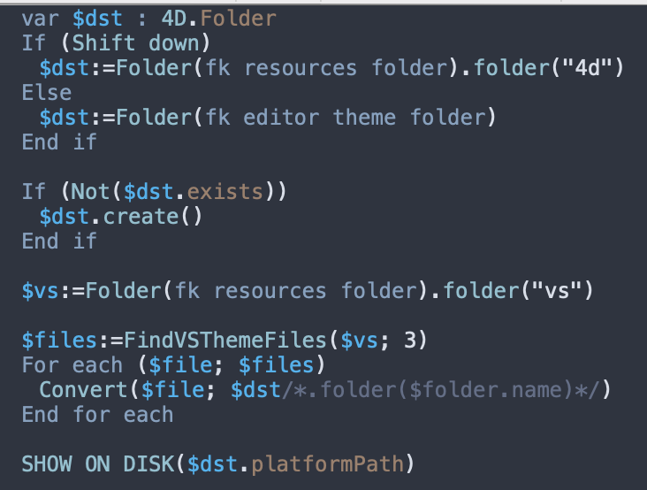

# Nord 4D Theme

Based entirely on [Nord VSCode Theme](https://github.com/arcticicestudio/nord-visual-studio-code).



## To install

Take JSON files and put them into 4D editor themes folder. (on macOS `$HOME/Library/Application Support/4D/4D Editor Themes`)

Then select it in 4D v19+ preferences.

### On macOS

Open a terminal you can type

```bash
curl -sL https://raw.githubusercontent.com/mesopelagique/nord-4d-theme/main/nord-color-theme.json -o $HOME/Library/Application\ Support/4D/4D\ Editor\ Themes/nord-color-theme.json
```

## Others

### Convert any visual studio code theme to 4D theme

https://github.com/mesopelagique/VSThemeConverter

### Other components

[](https://mesopelagique.github.io/)
